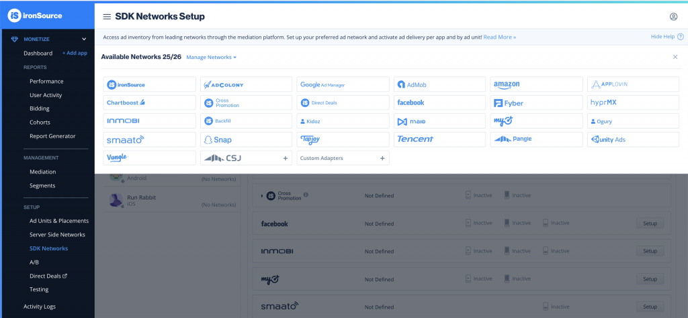
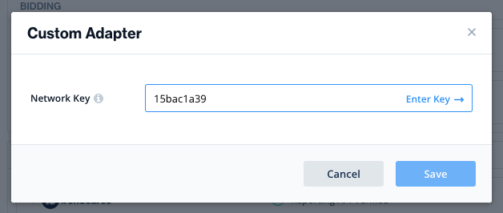
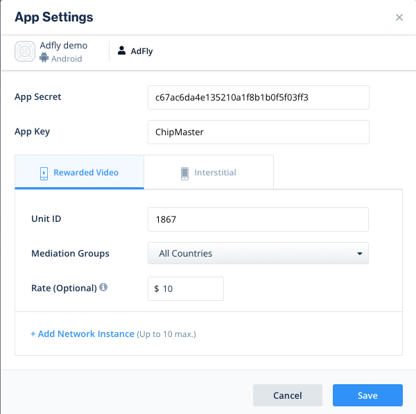
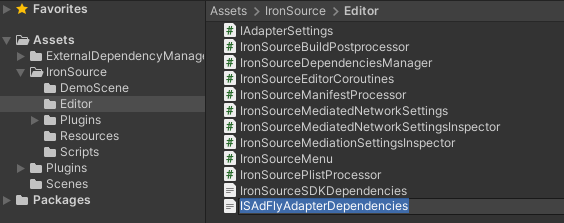

# ironSource 通过聚合方式集成 AdFly

## 其他语言
* en [English](english.md)

### 支持的广告
1. 激励视频
2. 插屏广告

### 支持的平台
1. Android

### ironSource版本
7.2.1.1以上版本

## 在 ironSource 后台添加聚合配置

### 1. 添加 SDK Network
在 ironSource 控制后台, 选择 [MONETIZE > Setup -> SDK Networks](https://platform.ironsrc.com/partners/monetize/mediation/setup). 然后点击 **“Manage Networks”** 并选择 **“Custom Adapter”**。



输入 **Network Key** 为 **“15bac1a39”**，点击 **Enter Key** ，当 Network Key 识别到后就可以看到 Adapter 的名称，然后点击 **Save** 保存。



### 2. 配置 Custom Adapter
在 SDK Networks 中，点击选择需要配置的应用后，在 Networks 列表中选择 AdFly 并点击 Setup。



- **App Secret**：填写为 AdFly 的 secret
- **App Key**：填写为 AdFly 的 key
- **Unit ID**：填写为 AdFly 的 Unit ID
- **Rate**：填写为 AdFly 该广告位的 eCMP 价格。官方参考：[Instance rate](https://developers.is.com/ironsource-mobile/general/instance-rate-2/#step-1)

## Android集成配置

### 1. 在Android中集成ironSource
参考 [ironSource官方文档](https://developers.is.com/ironsource-mobile/android/android-sdk/)

### 2. 添加依赖库
在 project 根目录下的 `build.gradle` 文件中添加 `mavenCentral()` 作为依赖库的源

```
allprojects {
    repositories {
       // ... other repositories

        mavenCentral()
    }
}
```

在 app 模块的 `build.gradle` 中添加 adfly 依赖

```
dependencies {
    // ... other project dependencies

    implementation 'pub.adfly:adapter-ironsource:0.11.+'
}
```

## Unity集成配置

### 1. 在Unity中集成ironSource
参考 [ironSource官方文档](https://developers.is.com/ironsource-mobile/unity/unity-plugin/)

### 2. 添加AdFly依赖
在 `Assets/IronSource/Editor` 目录下添加文件：`IronSourceSDKDependencies.xml`

```xml
<dependencies>
    <unityversion>4.3.37.2</unityversion>
  <androidPackages>
    <androidPackage spec="pub.adfly:adapter-ironsource:0.11.8.0">
      <repositories>
        <repository>https://repo1.maven.org/maven2/</repository>
      </repositories>
    </androidPackage>
  </androidPackages>
</dependencies>
```



## 检查是否接入成功

正常接入成功后，如果请求激励视频在 logcat 中过滤 `AdFly` 后会有以下的日志输出：

```
D/AdFlyIronSourceAdapter: initialize, configuration: {instanceName=Default, revByRate=true, customNetworkAdapterName=AdFlyCustomRewardedVideo, instanceType=1, customNetworkPackage=com.ironsource.adapters.custom.adfly, rateReporting=1, userId=null, isDefault=true, deleted=0, isCustomNetwork=true, maxAdsPerSession=99, customNetwork=AdFly, unitId=1867, appKey=xx, appSecret=xx}
I/AdFly: AdFly SDK
    ======Build Info======
    Version: 0.11.5
    Time: 2022-03-25 11:14:16
    Commit: 80d9df8
    ======Device Info======
    GAID: xx
    ======User Info======
    UserId: xx
D/AdFlyIronSourceAdapter: onInitializationFinished
D/AdFlyRewardedVideo: loadAd: 1867
D/AdFlyRewardedVideo: onRewardedAdLoadSuccess
```
