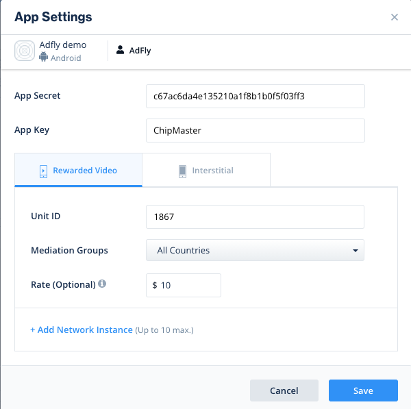

# Integrate AdFly by ironSource custom Networks

## Language
* ch [中文](chinese.md)

### Support ads
1. Reward
2. Interstitial

### Support platforms
1. Android

### ironSource version
7.2.1.1 or latest

## Add Network configurations in ironSource Dashboard

### 1. Add SDK Network
In the ironSource dashboard, select [MONETIZE > Setup -> SDK Networks](https://platform.ironsrc.com/partners/monetize/mediation/setup). then click **“Manage Networks”** and select **“Custom Adapter”**。


Enter **“15bac1a39”** for the **Network Key**, Click **Enter Key**, Once the network key is recognized, you’ll be able to see the network’s name and save it。


### 2. Configure Custom Adapter
In the SDK Networks, Select which app you want to configure，Select AdFly in the Networks list and click Setup。



- **App Secret**: secret of AdFly
- **App Key**: key of AdFly
- **Unit ID**: Unit ID of AdFly
- **Rate**：eCMP of AdFly。Reference：[Instance rate](https://developers.is.com/ironsource-mobile/general/instance-rate-2/#step-1)

## Integrate in Android

### 1. Integrate ironSource in Android
Reference [ironSource Integration](https://developers.is.com/ironsource-mobile/android/android-sdk/)

### 2. Add dependency libraries
Open your project and update the project’s `build.gradle` to include the following repositories.

```
allprojects {
    repositories {
       // ... other repositories

        mavenCentral()
    }
}
```

Open your app module's `build.gradle` to include the following dependencies.

```
dependencies {
    // ... other project dependencies

    implementation 'pub.adfly:adapter-ironsource:0.11.+'
}
```

