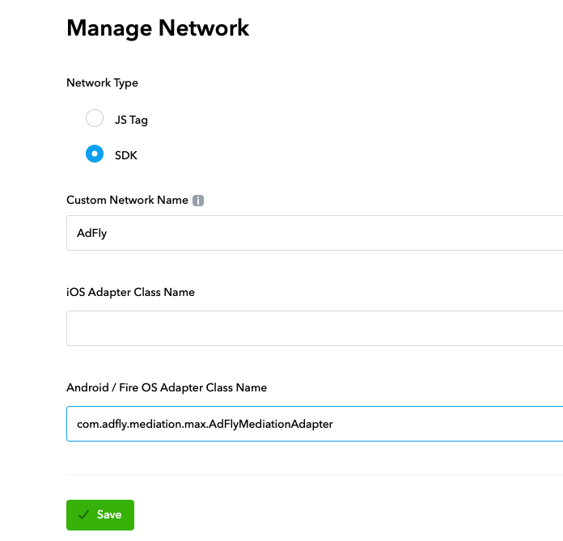
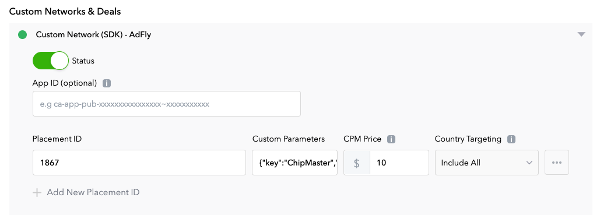

# Max 通过聚合方式集成 AdFly

## 其他语言
* en [English](english.md)

### 支持的广告
1. 激励视频
2. 原生广告
3. 插屏广告
4. Banner广告
5. MRECs

### 支持的平台
1. Android
2. Unity

### AppLovin版本
11.2.0以上版本

## 在Max 后台添加聚合配置

### 1. 添加 Network 配置
在 MAX 控制后台, 选择 [MAX > Mediation > Manage > Networks](https://dash.applovin.com/o/mediation/networks/). 然后点击底部的 **“Click here to add a Custom Network”**，进入自定义聚合配置页面。



- **Network Type**：选择 `SDK`.
- **Name**: 输入 `AdFly`
- **Android Adapter Class Name**: 输入 `com.adfly.mediation.max.AdFlyMediationAdapter`

### 2. 在 Units 中添加 AdFly SDK
在Max控制后台中打开 [MAX > Mediation > Manage > Ad Units](https://dash.applovin.com/o/mediation/ad_units/)，选择一个广告Unit，打开前一个步骤中添加的自定义 Network。



- **App ID**：不设置
- **Placement ID**：填写为 AdFly 的 Unit ID
- **Custom Pameters**：为 json 格式配置，需要配置为 AdFly 的 key 和 secret
例如：

```
{"key":"YOUR_ADFLY_KEY","secret":"YOUR_ADFLY_SECRET"}
```

- **CMP Price**：AdFly 该广告位的 CMP 价格。

## Android集成配置
### 1. 在Android中集成MAX
参考 [MAX官方文档](https://dash.applovin.com/documentation/mediation/android/getting-started/integration)

### 2. 添加依赖库
在 project 根目录下的 `build.gradle` 文件中添加 `mavenCentral()` 作为依赖库的源

```
allprojects {
    repositories {
       // ... other repositories

        mavenCentral()
    }
}
```

在 app 模块的 `build.gradle` 中添加 adfly 依赖

```
dependencies {
    // ... other project dependencies

    implementation 'pub.adfly:adapter-max:0.20.+'
}
```

## Unity集成配置

### 1. 在Unity中集成MAX
参考 [MAX官方文档](https://dash.applovin.com/documentation/mediation/unity/getting-started/integration)

### 2. 添加AdFly依赖
在 `Assets/MaxSdk/Mediation` 目录下添加文件：`AdFly/Editor/Dependencies.xml`

```xml
<?xml version="1.0" encoding="utf-8"?>
<dependencies>
    <androidPackages>
        <androidPackage spec="pub.adfly:adapter-max:0.20.0.0">
            <repositories>
                <repository>https://repo1.maven.org/maven2/</repository>
            </repositories>
        </androidPackage>
    </androidPackages>
</dependencies>
```


## 检查是否接入成功

正常接入成功后，如果请求激励视频在 logcat 中过滤 `AdFly` 后会有以下的日志输出：

```
D/MaxAdapter: initialize, params: Bundle[{secret=xx, key=xx}]
    serverParams: Bundle[{amount=0, app_id=, network_name=AdFly, is_muted=false, adapter_class=com.adfly.mediation.max.AdFlyMediationAdapter, custom_parameters=Bundle[{secret=xx, key=xx}], currency=}]
    localParams: {}
D/AdFlyMaxAdapter: loadRewardedAd: 1867
I/AdFly: AdFly SDK
    ======Build Info======
    Version: 0.11.7
    Time: 2022-03-31 17:46:51
    Commit: 3d87785
    ======Device Info======
    GAID: xx
    ======User Info======
    UserId: xx
D/AdFlyMaxAdapter: onInitializationFinished
D/AdFlyMaxAdapter: onRewardedAdLoadSuccess
```
