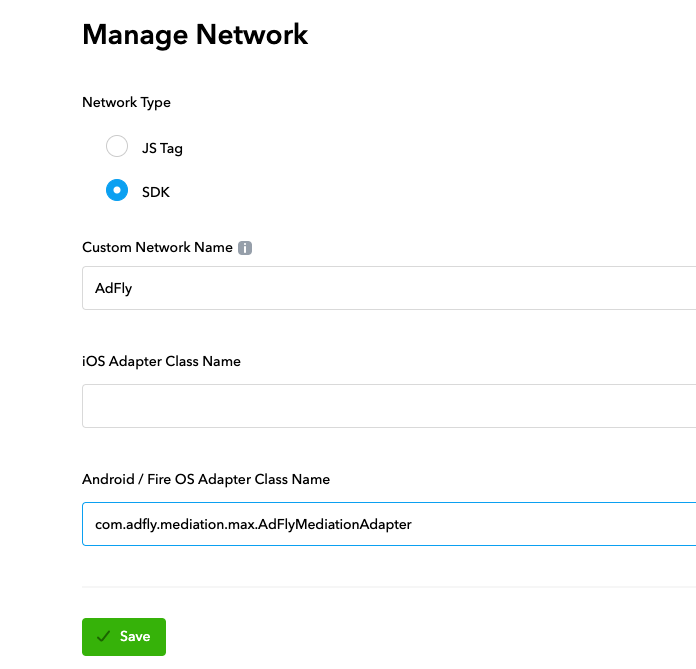
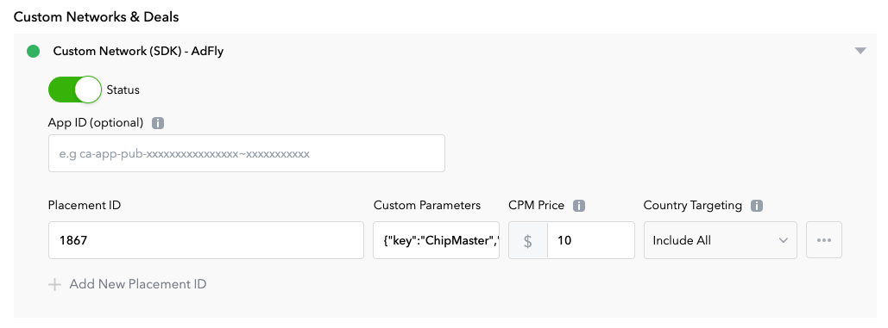
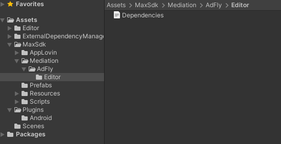

# Integrate AdFly by Max custom Networks

## Language
* ch [中文](chinese.md)

### Support ads
1. Reward
2. Native
3. Interstitial
4. Banner

### Support platforms
1. Android
2. Unity

### AppLovin version
11.2.0 or latest

## Add Custom Network configurations in Max Dashboard

### 1. Add Network configurations
In the MAX Dashboard, select [MAX > Mediation > Manage > Networks](https://dash.applovin.com/o/mediation/networks/). Then click **"Click here to add a Custom Network"** at the bottom of the page. The Create Custom Network page appears. Add the information about your custom network:



- **Network Type**：Select `SDK`.
- **Name**: Input `AdFly`
- **Android Adapter Class Name**: Input `com.adfly.mediation.max.AdFlyMediationAdapter`

### 2. Enable the Custom SDK Network
Open [MAX > Mediation > Manage > Ad Units](https://dash.applovin.com/o/mediation/ad_units/) in the MAX dashboard and select an ad unit for which you want to add the custom SDK network that you created in the previous step.



- **App ID**：Empty
- **Placement ID**： Unit ID of AdFly
- **Custom Pameters**：The configurations of json format，Contains AdFly  key and secret
Example：

```
{"key":"YOUR_ADFLY_KEY","secret":"YOUR_ADFLY_SECRET"}
```

- **CMP Price**：CMP price of AdFly。

## Integrate in Android

### 1. Integrate MAX in Android
Reference: [MAX Integration](https://dash.applovin.com/documentation/mediation/android/getting-started/integration)

### 2. Add dependency libraries
Open your project and update the project’s `build.gradle` to include the following repositories.

```
allprojects {
    repositories {
       // ... other repositories

        mavenCentral()
    }
}
```

Open your app module's `build.gradle` to include the following dependencies.

```
dependencies {
    // ... other project dependencies

    implementation 'pub.adfly:adapter-max:0.11.+'
}
```

## Integrate in Unity

### 1. Integrate MAX in Unity
Reference: [MAX Integration](https://dash.applovin.com/documentation/mediation/unity/getting-started/integration)

### 2. Add dependencies
Add `AdFly/Editor/Dependencies.xml` in folder `Assets/MaxSdk/Mediation`：

```xml
<?xml version="1.0" encoding="utf-8"?>
<dependencies>
    <androidPackages>
        <androidPackage spec="pub.adfly:adapter-max:0.11.8.0">
            <repositories>
                <repository>https://repo1.maven.org/maven2/</repository>
            </repositories>
        </androidPackage>
    </androidPackages>
</dependencies>
```




## Check integrate successful

After integrate is successful，If request Reward ads, filter  `AdFly` in logcat will have logs like these:

```
D/MaxAdapter: initialize, params: Bundle[{secret=xx, key=xx}]
    serverParams: Bundle[{amount=0, app_id=, network_name=AdFly, is_muted=false, adapter_class=com.adfly.mediation.max.AdFlyMediationAdapter, custom_parameters=Bundle[{secret=xx, key=xx}], currency=}]
    localParams: {}
D/AdFlyMaxAdapter: loadRewardedAd: 1867
I/AdFly: AdFly SDK
    ======Build Info======
    Version: 0.11.7
    Time: 2022-03-31 17:46:51
    Commit: 3d87785
    ======Device Info======
    GAID: xx
    ======User Info======
    UserId: xx
D/AdFlyMaxAdapter: onInitializationFinished
D/AdFlyMaxAdapter: onRewardedAdLoadSuccess
```
